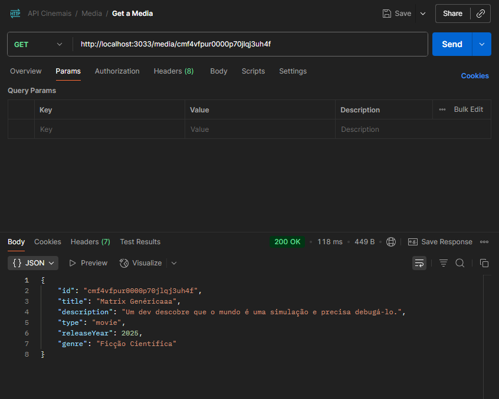

# Cinemais API

Bem-vindo(a) à API do projeto Cinemais! Este projeto foi construído para simular o back-end de uma plataforma de streaming, onde você pode gerenciar um catálogo de filmes e séries, além de criar e organizar as listas de favoritos dos usuários. Nossa meta principal foi entregar um serviço robusto, organizado e escalável, pronto para crescer.

---

## 1. Justificativa das Escolhas Técnicas

* **NestJS**: A escolha por NestJS foi estratégica. Ele nos permitiu adotar uma **arquitetura híbrida** que combina a orientação a objetos, a programação funcional e a reatividade. Essa abordagem não apenas organiza o código de forma lógica, mas também facilita a escalabilidade, pois a aplicação pode ser dividida em módulos independentes. O NestJS, com sua base em TypeScript, nos deu a segurança de tipagem que é essencial para prevenir erros e garantir que o projeto seja fácil de manter, mesmo quando novas funcionalidades são adicionadas.
* **PostgreSQL e Prisma**: Para o banco de dados, a combinação do PostgreSQL com o Prisma foi a nossa aposta em eficiência. O PostgreSQL é um banco de dados relacional poderoso e confiável. O Prisma, por sua vez, atua como uma camada de abstração que simplifica nossa interação com o banco. Com ele, eliminamos a necessidade de escrever queries SQL manualmente, garantindo um código mais limpo e seguro. O maior benefício foi o seu "type-safety", que nos permitiu detectar erros de tipagem no momento do desenvolvimento, em vez de em tempo de execução.

---

## 2. Como Rodar o Projeto

### Pré-requisitos
Certifique-se de ter o Docker e o Docker Compose instalados em sua máquina.

Certifique-se de adicionar o arquivo .env na raiz do projeto, copiar e colar o conteudo de .env.example .

### Executando com Docker Compose (Recomendado)
Esta é a forma mais simples e preferencial de rodar o projeto, pois ele já orquestra o contêiner da aplicação e o banco de dados PostgreSQL.

1.  Clone este repositório.
2.  Na raiz do projeto, execute o comando:
    ```bash
    docker-compose up --build
    ```
3.  O servidor estará disponível na porta `3033` (ou a porta configurada no `docker-compose.yml`).

### Executando Localmente
Se preferir, você pode rodar a aplicação localmente.

1.  Instale as dependências:
    ```bash
    npm install
    ```
2.  Configure a variável de ambiente `DATABASE_URL` no arquivo `.env`.
3.  Rode a migração do banco de dados para criar as tabelas:
    ```bash
    npx prisma migrate dev --name init
    ```
4.  Inicie a aplicação:
    ```bash
    npm run start:dev
    ```

---

## 3. Como Rodar os Testes

Este projeto contém testes unitários para a lógica de negócio principal e testes de integração (e2e) para os endpoints da API.

* Para rodar os testes de unidade:
    ```bash
    npm run test
    ```
* Para rodar os testes de integração:
    ```bash
    npm run test:e2e
    ```

---

## 4. Documentação dos Endpoints

Você pode interagir com todos os endpoints da API através da nossa documentação interativa, construída com o Swagger. Para acessá-la, basta abrir o seu navegador após iniciar o servidor:

**`http://localhost:3033/api-docs`**

A seguir, alguns exemplos de como você pode usar o `cURL` para fazer requisições à API (OBS: os dados de ID foram colocados de forma random, devem ser alterados na hora de usar para os que a pessoa cadastrou e recebeu):

A seguir, veja como você pode usar o Postman para fazer as requisições:

### Gerenciamento do Catálogo de Mídia (`/media`)

#### **`POST /media`**
Adiciona um novo item ao catálogo. Certifique-se de que o corpo da requisição esteja no formato `JSON`.


#### **`GET /media`**
Lista todos os itens de mídia.


#### **`GET /media/{id}`**
Busca um item específico pelo ID.



### Gerenciamento da Lista de Favoritos (`/users/{userId}/favorites`)

#### **`POST /users`**
Cria um usuário novo para poder adicionar os favoritos.


#### **`POST /users/{userId}/favorites`**
Adiciona um favorito à lista de um usuário. O `mediaId` deve ser enviado no corpo da requisição, no formato `JSON`.


#### **`GET /users/{userId}/favorites`**
Lista todos os favoritos de um usuário.


#### **`DELETE /users/{userId}/favorites/{mediaId}`**
Remove um favorito da lista de um usuário.

